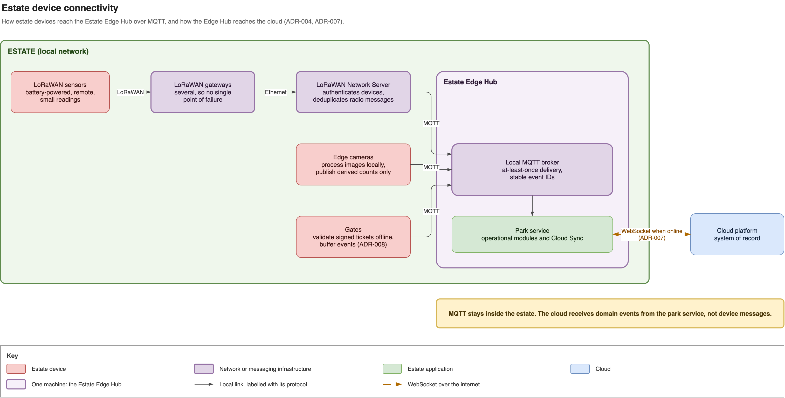

# Estate device connectivity using LoRaWAN, local IP and MQTT

Date: 2026-09-07

Owner: MJE

## Status

Accepted

## Context

Estate Devices include remote environmental and animal sensors, cameras, counters and
admission gates. They are distributed across grounds with patchy Wi-Fi, but have very
different needs: battery-powered sensors send small readings, cameras need bandwidth,
and gates must validate tickets within one second even when the internet or cloud is
unavailable ([QA-01](../quality-attributes.md#qa-01-availability),
[QA-07](../quality-attributes.md#qa-07-performance-and-scale)). No single network is
suitable for all of them.

Alternatives considered:

- Wi-Fi for every device. Rejected because its coverage is patchy and extending it
  across the estate is unnecessary for small sensor readings.
- LoRaWAN for every device. Rejected because limited bandwidth and downlink capacity do
  not suit cameras or interactive gate admission.
- Direct device-to-cloud connections. Rejected because local operation would then depend
  on the internet and every device would need its own cloud integration.
- One vendor-specific integration per device type. Rejected because device protocols
  would leak into the park service and make devices harder to replace.

## Decision

Use mixed connectivity according to each Estate Device's operational needs, with MQTT as
the common messaging transport inside the estate.

- Remote, battery-powered, low-data sensors use LoRaWAN. Multiple gateways provide
  coverage and avoid making one gateway the production single point of failure.
- Gateways use the local estate network, preferably Ethernet or PoE, to reach a locally
  hosted LoRaWAN Network Server. The Network Server authenticates devices, deduplicates
  radio messages and publishes normalized observations to the local MQTT broker.
- Edge cameras process images locally and publish only derived observations such as
  counts, confidence and device health. They buffer observations while disconnected and
  publish them over MQTT when local IP connectivity is available. Raw footage is not
  transported through MQTT and is retained locally only when explicitly configured.
- Each gate caches public verification keys and admission rules, validates a ticket
  without waiting for MQTT or the cloud, and buffers its resulting events until it can
  publish them. The validation rules are defined in
  [ADR-008](adr-008-signed-offline-ticket-validation.md).
- MQTT delivery is at least once. Messages carry a stable ID, occurrence time, producer
  identity and schema version; consumers deduplicate by ID
  ([ADR-005](adr-005-integration-through-domain-events.md)).
- The Estate Edge Hub processes device events locally and synchronizes domain events to
  the cloud separately ([ADR-007](adr-007-estate-cloud-sync-protocol.md)).

The choice of LoRaWAN products, frequency plan, gateway placement and device classes is
deferred until an estate radio survey and field trial. Device credential management is
covered by [ADR-012](adr-012-identity-authorization-attribution.md).

## Consequences

- Remote sensors gain long range and battery life. Local camera processing reduces
  bandwidth use and allows observations to continue during a network outage.
- Admissions and sensor collection continue locally during an internet outage.
- MQTT provides one integration boundary for the Estate Edge Hub, but it does not repair
  missing radio or Wi-Fi coverage.
- We must operate and monitor LoRaWAN gateways and a Network Server, an MQTT broker,
  device credentials, local buffers and schema versions. Cameras still need occasional
  local IP connectivity for publishing, management and software updates.
- At-least-once delivery requires stable IDs and idempotent consumers. Gateway coverage,
  redundancy and recovery must be proven with a field trial.
