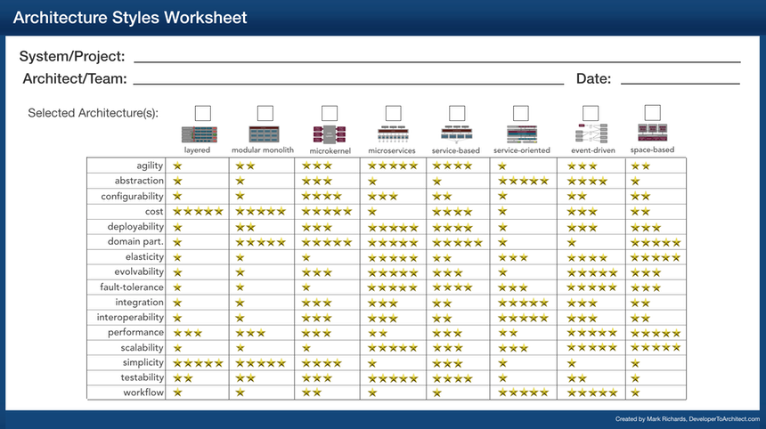

# Architecture style

Date: 2026-09-13

Owner: LJO

## Status

Proposed

## Context

[ADR-002](adr-002-bounded-contexts.md), [ADR-003](adr-003-deterministic-core-advisory-ai.md) and [ADR-009](adr-009-modular-monolith.md) decide boundaries, authority and the cloud deployable, but
none names the style of the whole system or shows what it was compared with. Changing
style later is the most expensive change we can make.

We rated the candidates with the architecture styles worksheet by Mark Richards
(*Fundamentals of Software Architecture*, Richards and Ford):

Driving characteristics, open for team discussion:

- Fault tolerance. Admission, ride safety and animal care continue without the internet,
  the cloud or the AI provider ([QA-01](../quality-attributes.md#qa-01-availability), [QA-02](../quality-attributes.md#qa-02-safety)).
- Simplicity. Three people build and run it ([ADR-009](adr-009-modular-monolith.md)).
- Evolvability. Providers and models will change; a context may need its own deployment
  later ([QA-06](../quality-attributes.md#qa-06-evolvability)).

Safety is not a driver because no style provides it; [ADR-003](adr-003-deterministic-core-advisory-ai.md) and [ADR-006](adr-006-policies-execute-at-edge.md) enforce it.
Scalability is not a driver because 15,000 visitors a day is not a load problem ([QA-07](../quality-attributes.md#qa-07-performance-and-scale)).

Alternatives considered, read against those three rows:

- Layered or modular monolith for the whole system. Rejected. One process cannot survive
  the cloud being unreachable from the estate.
- Microkernel. Rejected. Same fault-tolerance problem, and plug-ins fit a product with
  variants.
- Microservices. Rejected. Seven services and seven pipelines for three people ([ADR-009](adr-009-modular-monolith.md)).
- Event-driven alone. Rejected. Without a synchronous local core nothing admits a
  visitor.
- Service-oriented and space-based. Not rated. Enterprise orchestration and extreme
  elasticity are not our problems.

## Decision

The system is service-based with two coarse services, event-driven inside and between
them.

- The cloud platform runs Ticketing, Attraction Catalogue, Estate Insights and AI
  Decision Support, Staff Tasks and Alerts, and the cloud side of the operational
  contexts, as a modular monolith with one module per context ([ADR-009](adr-009-modular-monolith.md)).
- The park service on the Estate Edge Hub runs the operational core: admission, ride
  safety policies, animal-care recording and the local estate view. It works without the
  cloud. Devices reach it over MQTT ([ADR-004](adr-004-mixed-connectivity-mqtt.md)).
- Each service keeps its own event log and data. Nothing shares a database.
- Modules integrate through published domain events ([ADR-005](adr-005-integration-through-domain-events.md)); the two services exchange
  events over one WebSocket connection ([ADR-007](adr-007-estate-cloud-sync-protocol.md)). The cloud is the system of record.

See [cloud and estate](../diagrams/architecture-cloud-estate.png).

## Consequences

Strengthened:

- Fault tolerance. The park service is an availability boundary.
- Simplicity. Two deployables, two pipelines, one process to debug inside each.
- Evolvability. A module can leave the cloud platform as a deployment change ([ADR-009](adr-009-modular-monolith.md)).

Weakened:

- Testability. Two logs and asynchronous delivery make one visit harder to follow than a
  call stack. Tracing across both services is needed from the first release.
- Consistency. The cloud lags the estate during an outage ([QA-07](../quality-attributes.md#qa-07-performance-and-scale)). [ADR-008](adr-008-signed-offline-ticket-validation.md) exists because
  the two services can disagree for a while.

Open: whether Ticketing becomes its own cloud service, to keep the payment provider
integration and its compliance scope apart. Today [ADR-009](adr-009-modular-monolith.md) keeps it a module.
