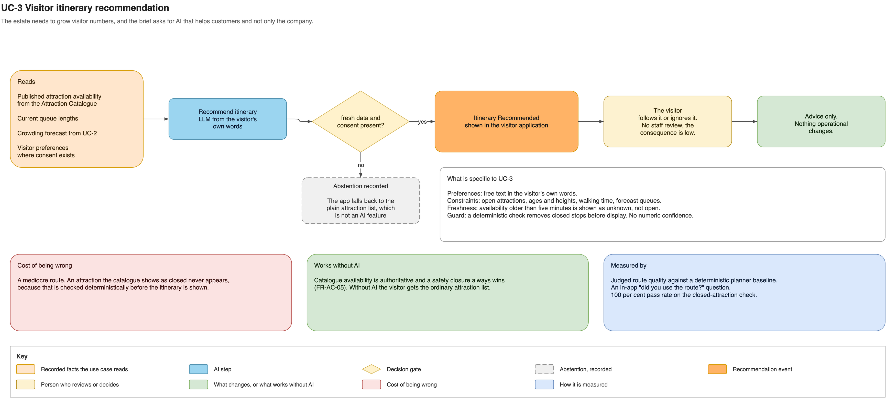

# AI Use Cases

Every use case below follows the same pattern. It reads recorded facts, returns a
recommendation with confidence and provenance, and hands consequential findings to a named
person. No use case changes a payment, an admission, a ride or an animal-care record.
That rule is [ADR-003](adrs/adr-003-deterministic-core-advisory-ai.md), and the shared
pipeline is drawn in
[the decision-support pattern](diagrams/ai-decision-support-pattern.png).

Five ship first. The selection is in [ADR-015](adrs/adr-015-first-release-ai-use-cases.md).
The model behind each one, the baseline it must beat and what its confidence means are in
[ADR-017](adrs/adr-017-ai-model-approach-and-confidence.md). What each is expected to change
for the estate is in [business outcomes and cost](business-outcomes.md).

| Use case | Business problem it solves | Status |
|---|---|---|
| [UC-1 Animal health anomaly detection](#uc-1-animal-health-anomaly-detection) | Sick animals are expensive. The Countess wants healthy animals. | First release |
| [UC-2 Crowd forecasting and staffing](#uc-2-crowd-forecasting-and-staffing) | Knowing where to invest and deploy staff. | First release |
| [UC-3 Visitor itinerary recommendation](#uc-3-visitor-itinerary-recommendation) | Growing visitor numbers and improving the visit. | First release |
| [UC-7 Piranha population count](#uc-7-piranha-population-count) | Checking population levels of the jumping piranha collection. | First release |
| [UC-8 Visitor feedback insights](#uc-8-visitor-feedback-insights) | Learning why visitors return or not, and where to invest. | First release |
| [UC-4 Animal narration](#uc-4-animal-narration) | Richer visitor experience at an enclosure. | Deferred |
| [UC-5 Virtual ride queue](#uc-5-virtual-ride-queue) | Shorter perceived waits at popular rides. | Deferred |
| [UC-6 Return-visit offers](#uc-6-return-visit-offers) | Bringing past visitors back. | Deferred |
| [UC-9 Pricing recommendations](#uc-9-pricing-recommendations) | Profitability and filling quiet days. | Deferred |
| [UC-10 Ask-the-estate assistant](#uc-10-ask-the-estate-assistant) | Answering investment questions for the Countess. | Deferred |
| [UC-11 Ride predictive maintenance](#uc-11-ride-predictive-maintenance) | Less ride downtime. | Deferred |

---

## UC-1 Animal health anomaly detection

How a finding reaches the keeper is drawn in
[AI task delivery](diagrams/ai-task-delivery.png).

**Problem.** Looking after the animals is costly, and far more costly once one is ill.
Over 200 animals across 55 enclosures is more than keepers can watch closely at all times.

**Reads.** `Animal fed` (food offered and consumed), `Animal Inspected` and keeper notes,
environmental readings and activity from enclosure sensors, `Enclosure Population Changed`.

**Model.** A language model with structured output reads the numbers and the keeper notes
together. It must beat a per-animal statistical baseline with keeper-defined rules.
Confidence is the calibrated share of five repeated runs that flag the animal
([ADR-017](adrs/adr-017-ai-model-approach-and-confidence.md)).

**Produces.** `Animal Anomaly Detected`, carrying a finding ID, confidence, model or rule
version, the source event references, creation time and expiry.

**Abstains when** the recent observation window is incomplete, for example after a long
estate outage or when a sensor has stopped reporting, when the animal has less than four
weeks of history, or when confidence falls below the configured threshold. An abstention
is recorded with its reason and no task is created.

**Reviewed by.** A Zookeeper, through a `Request Animal Inspection` task in Staff Tasks and
Alerts at the estate. The keeper inspects and records confirmed, not confirmed, or another
cause.

**Changes nothing on its own.** Only the keeper's recorded inspection changes animal
records. The model never produces a diagnosis.

**Cost of being wrong.** A missed anomaly means a late detection, which is why it is not
the only safety net. The deterministic overdue-feeding rule (FR-AE-11) and scheduled keeper
rounds run without AI. A false alarm costs keeper time, but a missed anomaly costs more,
so the confidence threshold favours recall over precision ([ADR-011](adrs/adr-011-ai-evaluation-human-review.md)).

**Measured by.** Recall, with a precision floor, against keeper-confirmed outcomes on the
test set. After release, the share of alerts a keeper confirms on inspection, not the
share of tasks accepted, and anomalies a keeper finds on rounds with no prior alert.

---

## UC-2 Crowd forecasting and staffing

**Problem.** The Countess needs to know where to invest and where to deploy staff, and
visitor numbers are expected to triple.

**Reads.** `Park Entered` and `Park Left`, `Visitor entered / left park area`,
`Area visitor count changed`, `Attraction entered`, queue entry and exit, current ride and
enclosure availability, and the same pattern from comparable past days.

**Model.** A language model forecasts each area two hours ahead and explains the staffing
trade-off. It must beat a same-weekday baseline. Confidence is the range of the forecast
across five runs. Staffing stays within limits the Operations Manager sets
([ADR-017](adrs/adr-017-ai-model-approach-and-confidence.md)).

**Produces.** `Attraction Popularity Computed`, `Crowd Forecast Produced`,
`Staffing Recommended`. A staffing recommendation expires at the start of its shift.

**Abstains when** the recent counting window has gaps, which happens after an outage or
when counting devices are missing from an area, or when the forecast range is too wide to
act on.

**Reviewed by.** The Operations Manager, who accepts, rejects or corrects the
recommendation. The outcome is recorded.

**Changes nothing on its own.** The deterministic `Area Capacity Exceeded` policy runs
separately at the edge and notifies operations whether or not the forecast exists. Crowding
response never waits for a model.

**Cost of being wrong.** Under-staffing or over-staffing for a shift. There is no safety
consequence, because the capacity response is deterministic and independent.

**Privacy.** Works on anonymous counts. No visitor identity is required. See QA-04.

**Measured by.** Forecast error against actual counts per area once they arrive, tested on
later weeks than the model was tuned on, and the acceptance rate of staffing
recommendations.

---

## UC-3 Visitor itinerary recommendation

**Problem.** The estate needs to grow visitor numbers, and the brief asks for AI that helps
customers and not only the company. A good visit is the thing visitors talk about.

**Reads.** Published attraction availability from the Attraction Catalogue, current queue
lengths, the crowding forecast from UC-2 with its range, and the visitor's stated
preferences where consent exists.

**Model.** A language model turns the visitor's own words into a route. It must beat a
deterministic route planner on judged route quality. There is no numeric confidence: the
route passes validation and the closed-attraction check, or the use case abstains
([ADR-017](adrs/adr-017-ai-model-approach-and-confidence.md)).

**Produces.** `Itinerary Recommended`, shown in the visitor application.

**Abstains when** availability data is stale, or the visitor has given no preferences and
no consent. The app then falls back to the plain attraction list, which is not an AI
feature.

**Reviewed by.** The visitor. They follow it or they ignore it. No staff review, because
the consequence of a poor suggestion is a less good afternoon.

**Changes nothing on its own.** It is advice inside the visitor application.

**Hard constraint.** A recommendation never contains a ride or enclosure the catalogue
shows as closed. This is checked deterministically before the itinerary is shown, not left
to the model.

**Freshness.** The catalogue can lag a closure made at the estate, most of all during an
internet outage. Availability older than *proposed* five minutes is shown as unknown, not
open, and the itinerary marks those stops. The itinerary therefore never guarantees that an
attraction is open. The closure itself is always enforced at the ride.

**Cost of being wrong.** A mediocre route, or a walk to an attraction that closed moments
ago. The checks above keep a wrong suggestion from sending anyone to an attraction known
to be closed.

**Measured by.** Judged itinerary quality on the test set ([ADR-011](adrs/adr-011-ai-evaluation-human-review.md)).
After release, the answer to one in-app question at the end of the visit day: "Did you
use the suggested route?" The closed-attraction check is a deterministic guard, tested at
100 per cent, not a model score.

---

## UC-7 Piranha population count

**Diagram:** [ai-piranha-count.png](diagrams/ai-piranha-count.png)

**Problem.** The brief asks for the population levels of the jumping piranha collection.
Counting fast-moving fish by eye is slow and inconsistent.

**Reads.** Frames from a camera over each tank, processed on the camera. Keeper spot
counts. The healthy population range per tank, set by the Zookeeper Staff Manager.

**Model.** A vision model on the edge camera counts the fish in several frames and
publishes only the count over MQTT ([ADR-004](adrs/adr-004-mixed-connectivity-mqtt.md),
[ADR-017](adrs/adr-017-ai-model-approach-and-confidence.md)). Confidence is the agreement
of the count across frames.

**Produces.** `Enclosure Population Counted`, with the count, frame agreement, model
version and time. When the trend for a tank leaves its healthy range, a finding asks the
Zookeeper Staff Manager to check it.

**Abstains when** the frames disagree, for example in murky water or at feeding time. No
count is published for that period.

**Reviewed by.** The Zookeeper Staff Manager, through a task when a tank is out of range.
Keepers keep a scheduled spot count, *proposed* weekly.

**Changes nothing on its own.** A camera count is a sensor observation. The recorded
population changes only when a keeper records it (FR-AE-06, FR-AE-09).

**Cost of being wrong.** A wrong count delays noticing a population change, or sends a
keeper to count for nothing. The weekly spot count bounds the delay.

**Privacy.** Frames never leave the camera, so visitors passing the tank are not recorded
by the platform ([ADR-013](adrs/adr-013-privacy-consent-retention.md)).

**Measured by.** Count error against keeper spot counts. Counts are shown as unvalidated
until the error stays within *proposed* 10 per cent for four weeks.

---

## UC-8 Visitor feedback insights

**Diagram:** [ai-visitor-feedback.png](diagrams/ai-visitor-feedback.png)

**Problem.** The Countess wants more returning visitors but does not know why visitors do
or do not come back, and does not know where to invest.

**Reads.** Anonymous post-visit feedback, submitted in the visitor application or website
without an account: a rating and free text per attraction. Attraction names from the
catalogue.

**Model.** A language model assigns each comment to themes, such as queues, cleanliness or
animal visibility, and to an attraction. Personal details are removed before the text is
stored or sent to the model ([ADR-013](adrs/adr-013-privacy-consent-retention.md)).
Confidence is the agreement of the theme across five runs
([ADR-017](adrs/adr-017-ai-model-approach-and-confidence.md)).

**Produces.** `Feedback Themes Summarized`, weekly per attraction: each theme, how often it
appears, and real example comments.

**Abstains when** the runs disagree on a comment. The comment is left unthemed, counted
and still readable.

**Reviewed by.** The Operations Manager reads the weekly summary with its example
comments.

**Changes nothing on its own.** It informs staffing and investment decisions.

**Cost of being wrong.** A misread priority. Each theme shows real comments, so the reader
can check the summary against what visitors actually wrote.

**Measured by.** Agreement with a hand-labelled sample each month. Over time, whether a
theme that was acted on is mentioned less often.

---

## Deferred

These stay in the catalogue because they are good ideas, not because they are next.

### UC-4 Animal narration

Location-aware narration about the animal in front of the visitor. Deferred because
narration invents plausible detail unless every claim is grounded in the animal record,
and telling visitors something false about a poisonous animal is a reputational and safety
problem. It also solves none of the three business problems the Countess named. Revisit
once grounding and review are proven on UC-1 and UC-3.

### UC-5 Virtual ride queue

Assigning visitors a return time instead of a physical queue. Deferred because it moves AI
next to admission, which is exactly where [ADR-003](adrs/adr-003-deterministic-core-advisory-ai.md)
says it must not go. A virtual queue also has to keep working during an outage, so it needs
a deterministic queue authority at the edge first. That is an operational feature with an
AI assist, not an AI feature.

### UC-6 Return-visit offers

Personalised offers based on a past visit. Deferred because it depends on consent scope,
retention rules and pricing rules that are not decided
([ADR-013](adrs/adr-013-privacy-consent-retention.md)). Shipping personalisation before the
consent model exists is the fastest way to turn a nice feature into a regulatory problem.
The staged path towards it is in [business outcomes](business-outcomes.md).

### UC-9 Pricing recommendations

Ticket prices or offers per date, suggested from a demand forecast within bounds the
Countess sets. Deferred because it needs a year of demand history and UC-2 proven first,
and a wrong price costs money directly.

### UC-10 Ask-the-estate assistant

Plain-language questions from the Countess, answered from read-only reports with the
figures shown. Deferred because revenue and cost per attraction are not yet in the
platform, so the most important questions have no data to answer them.

### UC-11 Ride predictive maintenance

Predicting ride faults from vibration and usage data. Deferred because it needs new
sensors on historic rides and fault history to learn from. The deterministic fault policy
already closes a faulty ride.

---

## What is common to all of them

| Property | Applies to every use case |
|---|---|
| Input | Recorded facts, or another use case's output identified as such, with its provenance and range. UC-3 reads the UC-2 forecast this way. Never an unidentified model output. |
| Model | A language model where free text or explanation matters, a vision model where the input is images. Each LLM use case must beat a non-LLM baseline ([ADR-017](adrs/adr-017-ai-model-approach-and-confidence.md)). |
| Output | A recommendation record with a finding ID, confidence, model or rule version, source events, creation time and, where it matters, expiry. |
| Uncertainty | Confidence has a defined meaning per use case. Abstention is a valid result and is recorded with its reason. |
| Authority | A person or a deterministic rule decides. The model never commands. Review starts in full and may relax to sampling once a use case earns it, never for the actions ADR-003 protects ([ADR-011](adrs/adr-011-ai-evaluation-human-review.md)). |
| Degradation | If a model or its provider is unavailable, the use case produces nothing and estate operations are unaffected. |
| Evaluation | Tuned on development data, judged on separate test data, and monitored after release. See [ADR-011](adrs/adr-011-ai-evaluation-human-review.md) and [the worked examples](ai-evaluation-examples.md). |
| Provenance | Sensor observation, AI inference, keeper decision and confirmed diagnosis stay separately identifiable (FR-AE-09). |
