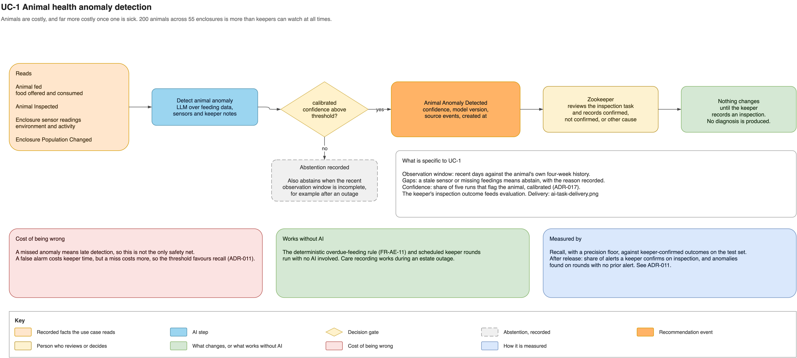

# Animal health anomaly detection

This use case helps keepers notice unusual patterns across more than 200 animals without
turning an AI finding into a diagnosis.

Sensor readings, feeding records, inspections and population changes are evaluated for
anomalies. With sufficient data and confidence, the system creates an inspection task;
otherwise it records no recommendation. A keeper reviews the animal and records the
actual outcome.

- **Authority:** the keeper's inspection is the fact; AI changes nothing directly.
- **Fallback:** scheduled rounds and the deterministic overdue-feeding rule continue.
- **Risk:** a missed anomaly delays attention; a false alarm costs keeper time.
- **Validation:** prioritize recall, then precision, against keeper-confirmed outcomes.

See [the complete use-case definition](../ai-use-cases.md#uc-1-animal-health-anomaly-detection),
[ADR-003](../adrs/adr-003-deterministic-core-advisory-ai.md),
[ADR-011](../adrs/adr-011-ai-evaluation-human-review.md),
[ADR-017](../adrs/adr-017-ai-model-approach-and-confidence.md) and the
[task delivery sequence](../diagrams/ai-task-delivery.png).
