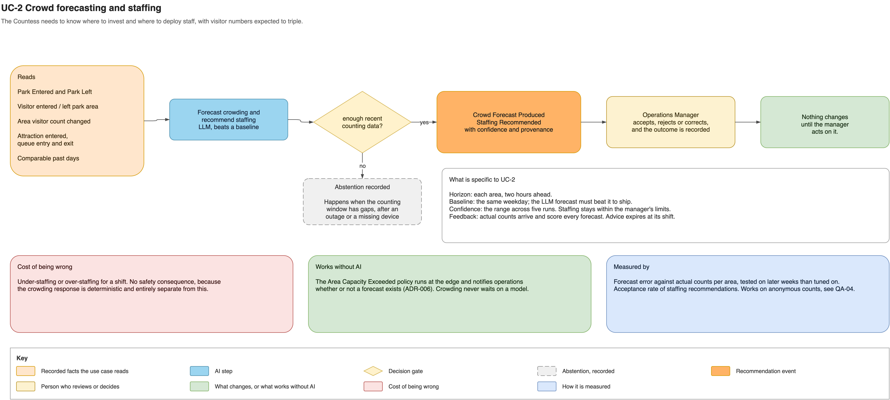

# Crowd forecasting and staffing

This use case helps the Operations Manager anticipate crowding and deploy staff before
queues form.

Anonymous area, gate, attraction and queue counts are combined with comparable past
days. With a complete recent window, the model produces a crowd forecast and staffing
recommendation; otherwise it abstains. The Operations Manager decides whether to act.

- **Authority:** no staffing or operational state changes without the manager.
- **Fallback:** the deterministic area-capacity policy continues at the estate edge.
- **Risk:** a poor forecast causes over- or understaffing, not a safety decision.
- **Validation:** forecast error by area and recommendation acceptance rate.

See [the complete use-case definition](../ai-use-cases.md#uc-2-crowd-forecasting-and-staffing),
[ADR-006](../adrs/adr-006-policies-execute-at-edge.md),
[ADR-011](../adrs/adr-011-ai-evaluation-human-review.md) and
[ADR-017](../adrs/adr-017-ai-model-approach-and-confidence.md).
