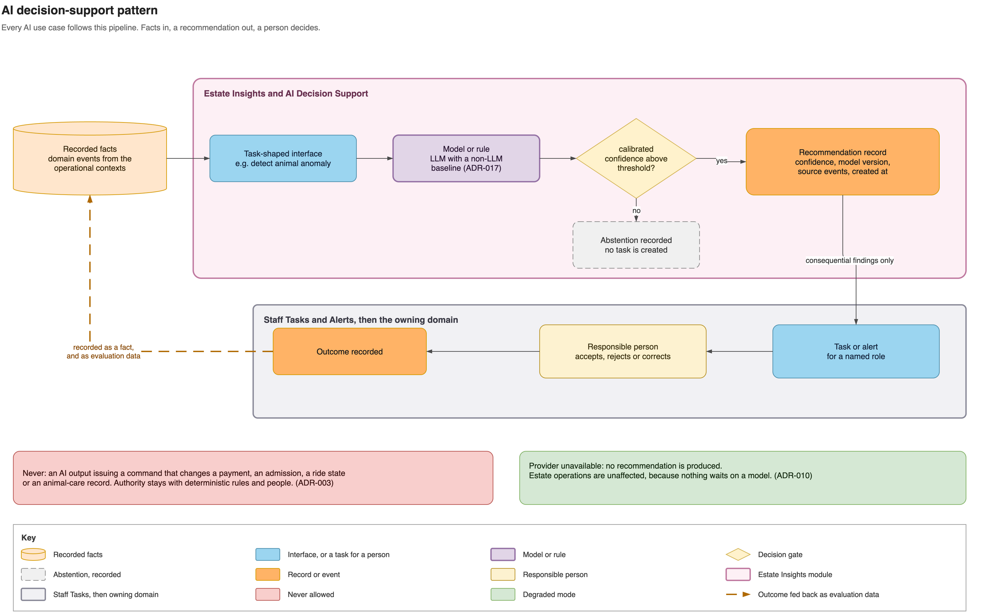

# AI decision support

AI consumes recorded facts and returns recommendations. It never changes a payment,
admission, ride state or animal-care record directly.

| Question | Answer | Decision or requirement |
|---|---|---|
| What can AI change? | Nothing consequential; deterministic rules and people decide. | [ADR-003](../adrs/adr-003-deterministic-core-advisory-ai.md) |
| Why an LLM here? | Each LLM use case must beat a simple non-LLM baseline on its own measure before it ships. | [ADR-017](../adrs/adr-017-ai-model-approach-and-confidence.md) |
| How is uncertainty handled? | Confidence has a defined, tested meaning per use case; abstention is valid. | [ADR-017](../adrs/adr-017-ai-model-approach-and-confidence.md), [FR-EI-07 and FR-EI-10](../functional-requirements.md#6-estate-insights-and-ai-decision-support) |
| Who verifies a recommendation? | Results are tested on separate data and monitored against outcomes such as keeper-confirmed findings and forecast error. | [ADR-011](../adrs/adr-011-ai-evaluation-human-review.md), [evaluation examples](../ai-evaluation-examples.md) |
| What if the provider fails or becomes too expensive? | Only Estate Insights changes provider or falls back to the baseline; estate operations continue without recommendations. | [ADR-010](../adrs/adr-010-ai-orchestration.md), [QA-06](../quality-attributes.md#qa-06-evolvability) |
| Can a result be explained? | Staff can see its inputs, confidence and model or rule version. | [QA-05](../quality-attributes.md#qa-05-explainability) |

Sensor observations, AI inferences, human decisions and confirmed outcomes remain
separately identifiable. The selected and deferred capabilities are documented in the
[AI use-case catalogue](../ai-use-cases.md), with the first-release selection justified
in [ADR-015](../adrs/adr-015-first-release-ai-use-cases.md).

## Evidence

- [AI use cases](../ai-use-cases.md) records inputs, models, outputs, abstention, human
  review, failure costs and measures, including what was deferred and why.
- [ADR-017](../adrs/adr-017-ai-model-approach-and-confidence.md) defines the baseline and
  meaning of confidence for every model-based use case.
- [ADR-011](../adrs/adr-011-ai-evaluation-human-review.md) defines development and test
  data, cold start, production monitoring and responses to poor model behaviour.
- [AI evaluation examples](../ai-evaluation-examples.md) show synthetic cases from input
  to pass or fail.
- [Business outcomes and cost](../business-outcomes.md) connects each use case to an
  estate outcome, measurement and operating cost.
- [AI task delivery](../diagrams/ai-task-delivery.png) shows how a cloud finding reaches a
  keeper, including after an outage.
