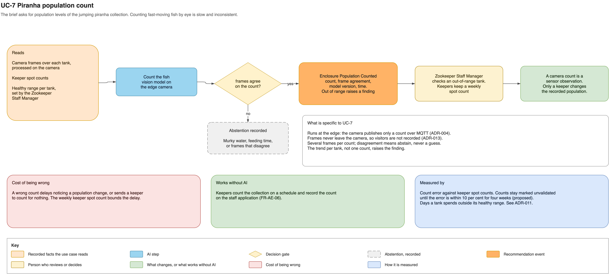

# Piranha population count

This use case checks the population levels of the jumping piranha collection, which the
brief asks for explicitly, without keepers counting fast-moving fish by eye every day.

A vision model on a camera over each tank counts the fish across several frames and
publishes only the count. When the frames disagree, for example in murky water, it
publishes nothing. When a tank's trend leaves its healthy range, the Zookeeper Staff
Manager gets a task to check it.

- **Authority:** a camera count is a sensor observation; only a keeper changes the
  recorded population.
- **Fallback:** keepers keep a scheduled spot count.
- **Risk:** a wrong count delays noticing a change; the spot count bounds the delay.
- **Validation:** count error against keeper spot counts.

See [the complete use-case definition](../ai-use-cases.md#uc-7-piranha-population-count),
[ADR-004](../adrs/adr-004-mixed-connectivity-mqtt.md) and
[ADR-017](../adrs/adr-017-ai-model-approach-and-confidence.md).
