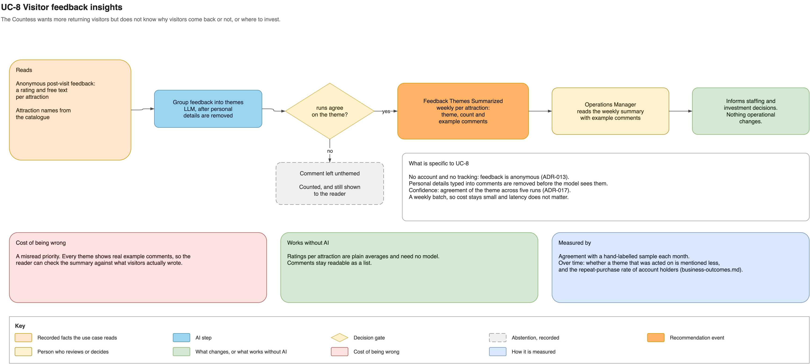

# Visitor feedback insights

This use case shows the Countess what visitors think of each attraction, as input to
investment decisions and to the goal of more returning visitors.

Visitors leave anonymous feedback after their visit. Personal details are removed, and a
language model groups the comments into themes per attraction. The Operations Manager
reads a weekly summary with real example comments beside each theme.

- **Authority:** the summary informs decisions; nothing operational changes.
- **Fallback:** ratings per attraction are plain averages, and comments stay readable.
- **Risk:** a misread priority; example comments let the reader check the summary.
- **Validation:** agreement with a hand-labelled sample each month.

See [the complete use-case definition](../ai-use-cases.md#uc-8-visitor-feedback-insights),
[ADR-013](../adrs/adr-013-privacy-consent-retention.md) and
[business outcomes](../business-outcomes.md).
