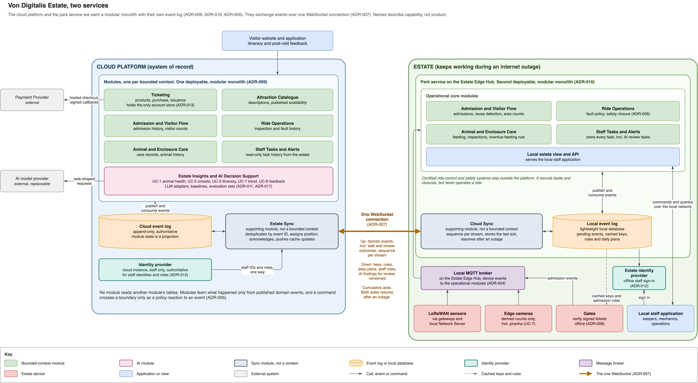

# Cloud and estate architecture

The platform consists of two modular monoliths. The cloud is authoritative, while the
Estate Edge Hub keeps essential park operations available during an internet outage.

## How it works

**The cloud platform is authoritative.** Its modular monolith keeps the authoritative
event log, serves the visitor application and runs cloud analysis.

**The estate keeps working without it.** The smaller modular monolith on the Estate Edge
Hub runs admission, ride safety, animal care and staff tasks from a local event log and
cached keys, rules, roles and daily plans. Gates validate signed tickets without the
cloud.

**Events go up, and a small cache and AI findings come down.** One resumable WebSocket
carries pending domain events to the cloud and versioned updates to the estate. Both sides
continue from their last acknowledgement after an outage. Published events integrate
state changes ([ADR-005](../adrs/adr-005-integration-through-domain-events.md)), and
ingestion deduplicates them by event ID.

Estate devices use the connectivity described in the
[connectivity view](../diagrams/connectivity-tiers.png). AI consumes recorded facts and
returns recommendations; it is not part of the operational control path. Consequential
findings reach Staff Tasks at the estate, which assigns them to a named person.

This view is justified by:

- [ADR-009](../adrs/adr-009-modular-monolith.md): begin with modular monoliths.
- [ADR-016](../adrs/adr-016-architecture-style.md): two deployables form the overall
  architecture style.
- [ADR-007](../adrs/adr-007-estate-cloud-sync-protocol.md): synchronize over one
  resumable WebSocket connection.
- [ADR-004](../adrs/adr-004-mixed-connectivity-mqtt.md): connect estate devices locally.
- [ADR-006](../adrs/adr-006-policies-execute-at-edge.md): execute operational policies at
  the estate edge.
- [ADR-008](../adrs/adr-008-signed-offline-ticket-validation.md): gates validate signed
  tickets offline.
