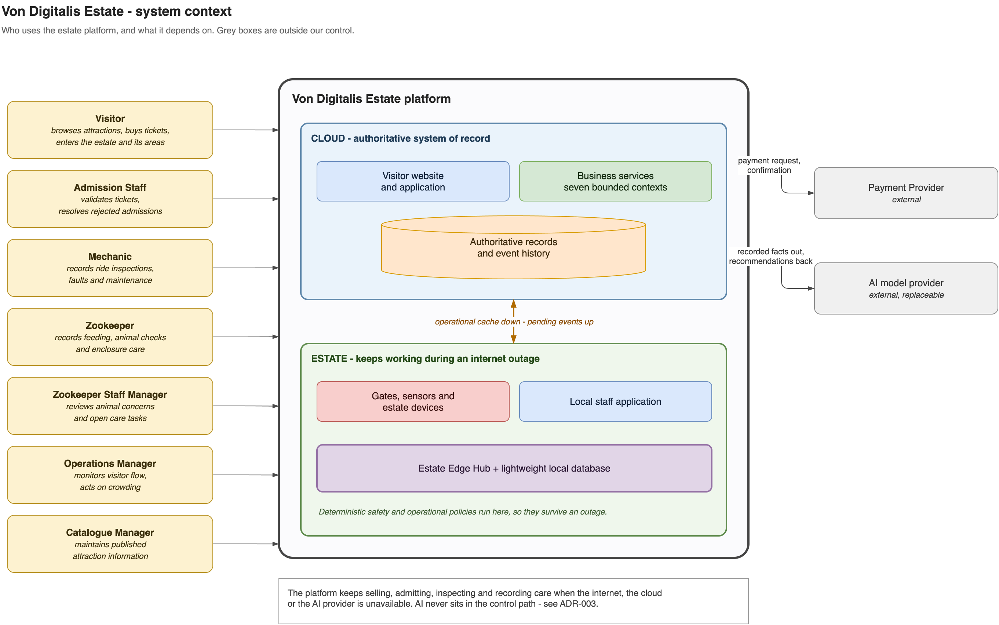

# System context

The system context shows who interacts with the estate platform and which external
systems it depends on. It deliberately treats the cloud and estate as one platform;
their internal separation is explained in the [cloud and estate view](cloud-estate.md).

Visitors browse and buy tickets, while estate staff operate admissions, rides and animal
care. The Payment Provider processes payments, and replaceable AI providers support
analysis without controlling operations.

The main decisions behind this boundary are:

- [ADR-003](../adrs/adr-003-deterministic-core-advisory-ai.md): AI remains advisory.
- [ADR-014](../adrs/adr-014-payment-provider.md): payments use an external provider.
- [ADR-012](../adrs/adr-012-identity-authorization-attribution.md): workforce identity
  remains available at the estate.

