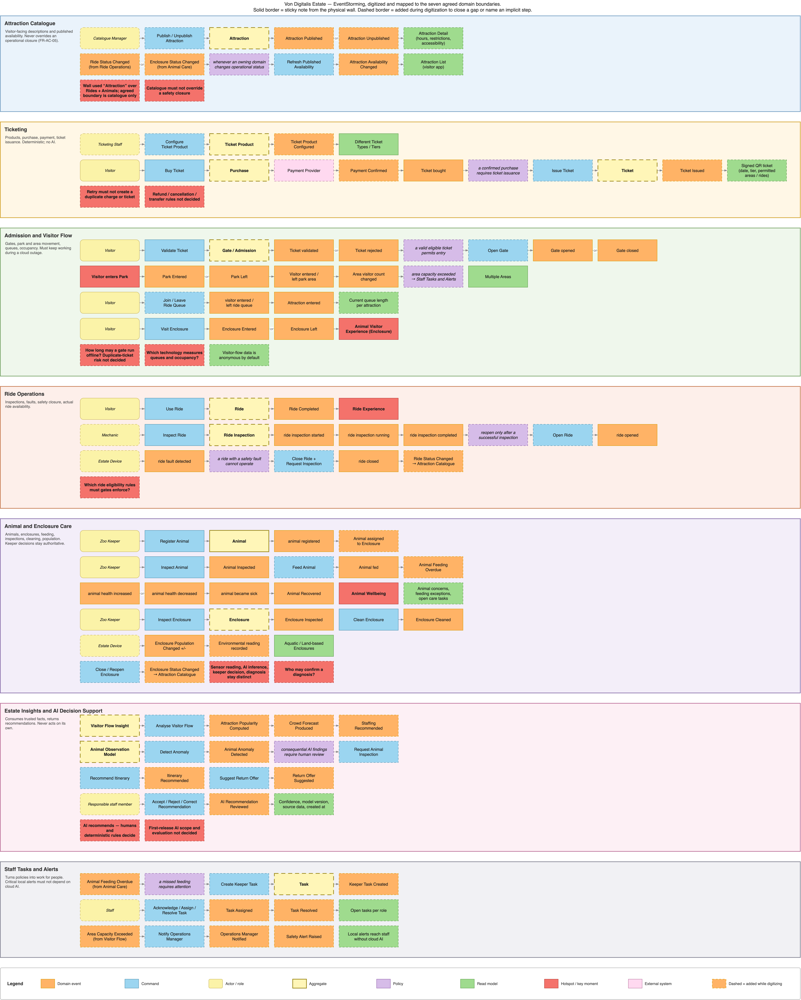
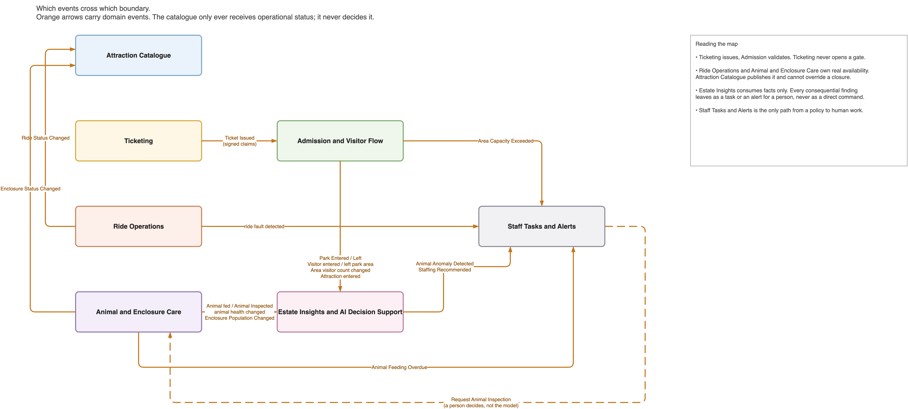
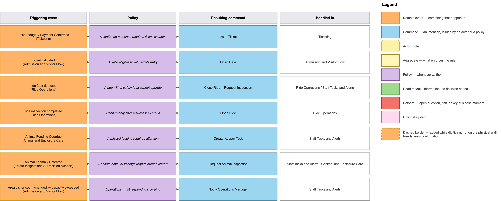

# EventStorming and domain discovery

The brief describes the Countess's goals, but not where system responsibilities belong.
We used EventStorming to discover the business flow, ownership boundaries and policies
before choosing the architecture, following [ADR-001](../adrs/adr-001-use-ddd.md).

## 1. Map the business flow

We mapped important facts such as `Ticket Issued`, `Park Entered`, `Ride Fault Detected`
and `Animal Fed`, then added the commands, people, devices and external systems involved.

Solid borders represent notes from the physical workshop. Dashed borders mark details
added during digitization, keeping later assumptions visible.

## 2. Find the domain boundaries

Grouping events by language, rules and ownership produced the seven bounded contexts in
[ADR-002](../adrs/adr-002-bounded-contexts.md).

The main boundaries became clear: Ticketing issues tickets while Admission validates
them; the operational domains own real availability while the Catalogue publishes it;
and Estate Insights advises without controlling operations. These hand-offs use
published events ([ADR-005](../adrs/adr-005-integration-through-domain-events.md)).

## 3. Identify cross-domain policies

We then followed important events across boundaries and assigned ownership of the
resulting action.

This separated recorded facts, deterministic policies and advisory AI findings. Essential
policies therefore execute at the estate edge
([ADR-006](../adrs/adr-006-policies-execute-at-edge.md)), while AI remains advisory
([ADR-003](../adrs/adr-003-deterministic-core-advisory-ai.md)).

## Outcome

The workshop produced the language, seven boundaries, event hand-offs and policies from
which the requirements and two-modular-monolith architecture were derived.

Editable source: [eventstorming-von-digitalis.drawio](eventstorming-von-digitalis.drawio).
